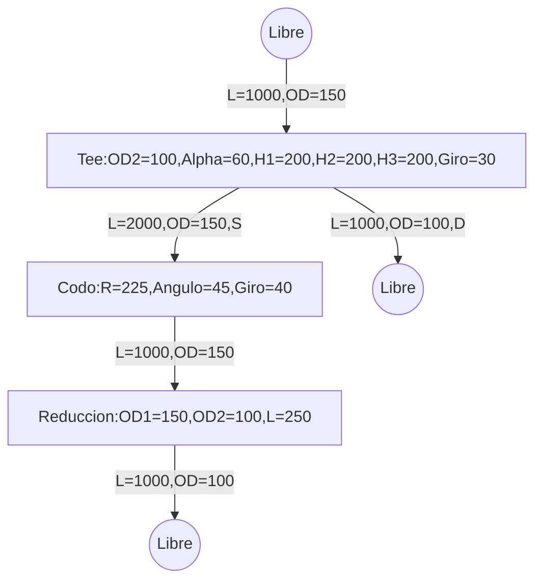

```mermaid
flowchart TD
1((Libre))
2["Tee:OD2=100,Alpha=60,H1=200,H2=200,H3=200,Giro=30"]
3["Codo:R=225,Angulo=45,Giro=40"]
4["Reduccion:OD1=150,OD2=100,L=250"]
5((Libre))
6((Libre))

1 -->|L=1000,OD=150| 2
2 -->|L=2000,OD=150,S| 3
3 -->|L=1000,OD=150| 4
4 -->|L=1000,OD=100| 5
2 -->|L=1000,OD=100,D| 6
```

