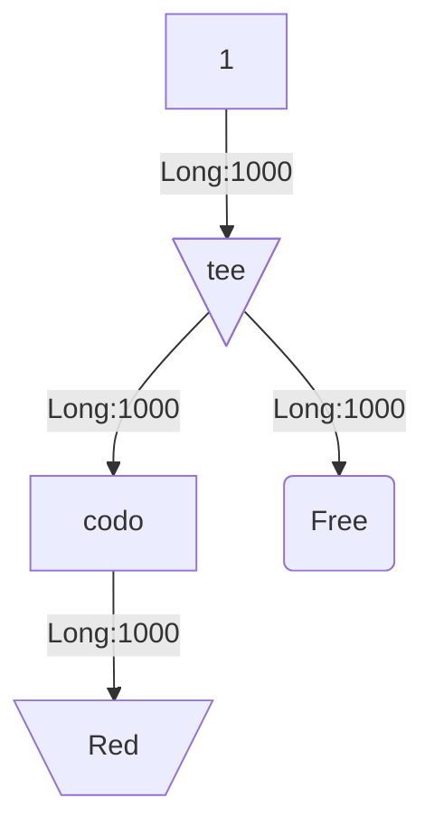
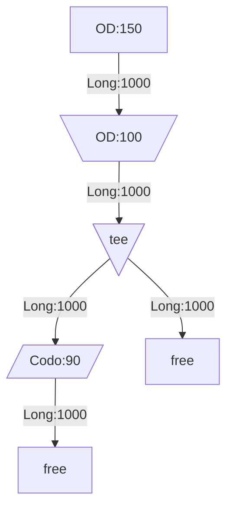

```mermaid
flowchart TD;
    1 -->|Long:1000| 2{tee};
    2 -->|Long:1000| 3[codo];
    3 -->|Long:1000| 4[\Red/];
    2 -->|Long:1000| 5(Free);

 2@{ shape: manual-file, label: "tee"}
```

```mermaid
flowchart TD;
    1[OD:150] -->|Long:1000| 2;
    2[\OD:100/] -->|Long:1000| 3;
    3 -->|Long:1000| 4;
    4[/Codo:90/] -->|Long:1000| 5[free];
    3[OD_2:80;Alpha:90] -->|Long:1000| 6[free];
3@{ shape: manual-file, label: "tee"}
```

