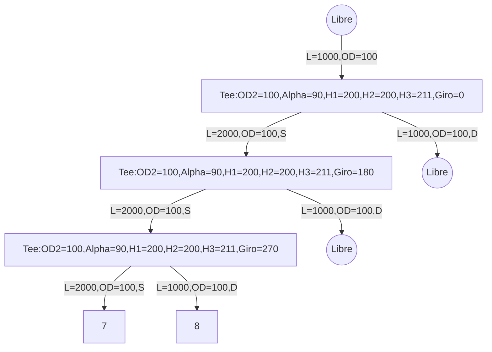

```mermaid
flowchart TD
1((Libre))
2["Tee:OD2=100,Alpha=90,H1=200,H2=200,H3=211,Giro=0"]
3["Tee:OD2=100,Alpha=90,H1=200,H2=200,H3=211,Giro=180"]
4((Libre))
5["Tee:OD2=100,Alpha=90,H1=200,H2=200,H3=211,Giro=270"]
6((Libre))

1 -->|L=1000,OD=100| 2
2 -->|L=2000,OD=100,S| 3
2 -->|L=1000,OD=100,D| 4
3 -->|L=2000,OD=100,S| 5
3 -->|L=1000,OD=100,D| 6
5 -->|L=2000,OD=100,S| 7
5 -->|L=1000,OD=100,D| 8
```

